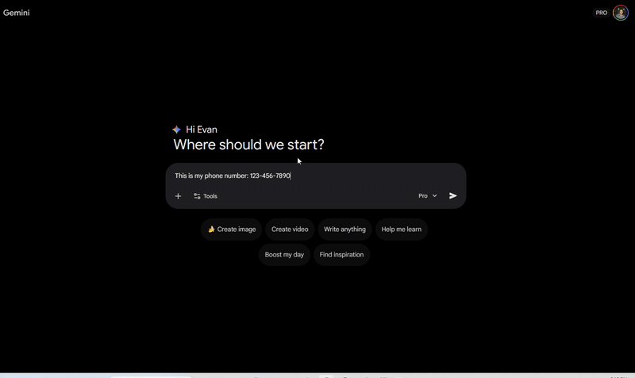

# 🛡️ TypeSafe (Alpha)
**The OS-Level Privacy Guard for AI.**

TypeSafe is an open-source security tool that prevents sensitive data (PII) from leaking into AI models like Gemini, ChatGPT, and Claude.

Unlike browser extensions, which are blind to desktop apps, TypeSafe uses Windows Accessibility APIs to monitor text fields at the operating system level. It sits quietly in the background and only activates when you are typing into a known AI interface.



## ⚠️ ALPHA RELEASE WARNING
**This software is currently in active development (v0.1.0).**

*   **Do not use for critical compliance needs yet.**
*   Expect bugs, especially on non-standard screen resolutions.
*   Current Support: Best experienced on Google Gemini in Chrome/Edge on Windows 10/11.

We are releasing this early to gather feedback from the security and developer community. Please report bugs in the Issues tab.

## ✨ Features
*   **OS-Level Interception:** Uses uiautomation to read text fields directly from the window manager.
*   **Privacy Filters:** Only scans text when the active window title matches an AI provider (e.g., "ChatGPT", "Gemini", "Claude"). We do not scan your banking or email windows.
*   **Local Processing:** All PII detection happens locally on your machine using Python and Regex/Microsoft Presidio. No data is ever sent to the cloud.
*   **Visual Guard:** Draws a transparent red overlay over the text box when secrets are detected.

## 🚀 Installation (for Developers)
TypeSafe is written in Python. To run the Alpha, you need Python 3.10+ installed.

1.  **Clone the repository:**
    ```bash
    git clone https://github.com/YOUR_USERNAME/TypeSafe.git
    cd TypeSafe
    ```

2.  **Install dependencies:**
    ```bash
    pip install -r requirements.txt
    ```
    *(Note: This installs uiautomation, pyqt6, and presidio-analyzer)*

3.  **Run the Guard:**
    ```bash
    python watcher.py
    ```

## 🛠️ Usage
1.  Run the script. You will see `watcher running....` in your console.
2.  Open Google Gemini (gemini.google.com) in your browser.
3.  Type a test secret into the prompt, for example:
    > "My secret credit card is 4000 1234 5678 9010"
4.  You should see a **Red Border** appear around the text box.
5.  If you try to hit **ENTER**, TypeSafe will block the input and warn you.

## 🗺️ Roadmap
- [x] v0.1: Basic Text Interception on Windows (Gemini Support).
- [ ] v0.2: Sanitize and send popup menu
- [ ] v0.3: Support for ChatGPT Desktop App, ChatGPT Web and Microsoft Copilot Desktop.
- [ ] v0.4: File Upload Interception (.pdf, .docx).
- [ ] v0.5: Mac compatibility
- [ ] v1.0: exe release

## 📄 License & Commercial Use
TypeSafe is open-source software licensed under the **GNU Affero General Public License v3.0 (AGPLv3)**.

**What this means:**
*   You are free to: Use, modify, and distribute this software.
*   **The Catch:** If you modify this software and use it as part of a service (internal or external), you must release your source code changes to the public under the same license.

## 💼 Commercial License
Do you want to use TypeSafe in your company without open-sourcing your modifications? 

We will offer a Commercial License that removes the AGPL restrictions and includes:
*   Signed MSI Installers (Easy deployment).
*   Centralized Admin Dashboard.
*   Priority Support.

Join the Waitlist for TypeSafe Pro

## 🤝 Development & Contribution Policy

**TypeSafe is built on a "Source Available" model.**

We believe that security tools requires absolute transparency. You should always be able to audit the code that monitors your inputs. However, to maintain strict **supply chain security** and code provenance, this repository operates as a **Broadcast-Only** codebase.

* **❌ Pull Requests:** We **do not** accept external code contributions or Pull Requests. Any PRs opened will be automatically closed to respect your time.
* **✅ Bug Reports:** If you find a bug, crash, or false positive, please [Open an Issue](link_to_issues). Your testing is invaluable to us.
* **✅ Security Audits:** If you find a security vulnerability, please report it via Issues (or email evanschwalb@gmail.com).
* **🍴 Forking:** Under the **AGPLv3** license, you are free to fork this repository for your own modifications, provided you adhere to the license terms.

**Why this model?**
It ensures that every line of code in the official TypeSafe release is written, vetted, and signed by our core team, guaranteeing the integrity of the software you install.

**Disclaimer:** TypeSafe is a security tool, not a guarantee. It is designed to catch accidental leaks, but no tool is 100% perfect. Always verify what you send to AI models.
